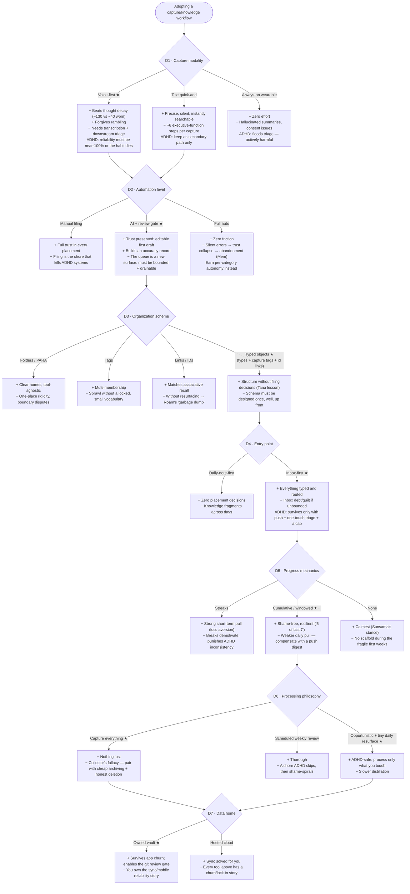

# Research: What Makes Personal-Brain Systems Work (and Fail) — with an ADHD Lens

*Compiled 2026-07-03 from ~30 targeted web sweeps. Sources favor primary docs and
user reports (Product Hunt, Trustpilot, App Store, personal write-ups, vendor
primary blogs, published research) over affiliate listicles. Claims resting on
thin evidence are flagged in §7.*

**How to read this:** §1 is the takeaway. §2–§4 are the field survey. §5 is the
distilled design principles. §6 maps everything to Brain Cockpit — what it
already gets right and a research-backed improvement backlog (each item also
logged as one line in `DEFERRED.md`, per the constitution's scope discipline).
The workflow-adoption decision tree is in §8 and as a styled page at
[`docs/workflow-decision-tree.html`](workflow-decision-tree.html).

---

## 1. Executive summary

Across every category — PKM vaults, voice capture, AI organizers, ADHD planners —
the same three-part loop decides whether a system survives contact with an ADHD
brain:

1. **Capture must beat the thought's decay.** Speech-first, forgiving of
   rambling, reliable to the point of paranoia. One silent loss kills the habit.
2. **Filing must not be the user's job — but it must be *reviewable*.**
   Manual filing is the chore that kills Obsidian/Notion systems; invisible AI
   filing is the trust collapse that killed Mem. The unoccupied middle —
   transparent AI routing with a one-touch human gate into user-owned files —
   is exactly where Brain OS sits. **This positioning is the system's biggest
   asset; protect it.**
3. **The archive must pay dividends, or guilt accumulates.** Systems die of
   collector's fallacy and "second-brain guilt" (the unprocessed pile as shame
   surface). Resurfacing (Readwise's model) is the only mechanism in the field
   that converts an archive from liability to daily reward — and almost nobody
   applies it to people's *own* notes.

The single most actionable cross-cutting finding: **fragile streaks are the
wrong progress mechanic for ADHD** — research shows broken chains demotivate
and punish inherent inconsistency. Cumulative and windowed metrics
("5 of the last 7 days") are shame-free and resilient.

---

## 2. The field, tool by tool

### 2.1 PKM / second-brain tools

**Obsidian** — *Great:* local Markdown = ownership, survives app churn; daily
notes as "a searchable junk drawer connected to everything" remove the
where-do-I-put-this decision ([autisticasfxxk guide](https://www.autisticasfxxk.com/blog/obsidian-guide/));
Tasks-plugin queries auto-compile scattered todos ([adhdftw](https://adhdftw.com/second-brain-tool-obsidian/));
Random Note/Serendipity plugins do zero-maintenance resurfacing
([obsidian.rocks](https://obsidian.rocks/embrace-serendipity-discovering-old-notes-in-obsidian/)).
*Gaps:* the plugin ecosystem is a hyperfocus trap ("elaborate setups without
doing actual work"); blank-canvas paralysis; slow mobile capture — ADHD users
engineer voice→inbox pipelines around it, i.e. exactly this project.

**Notion** — *Great:* templates/databases solve the blank-page problem.
*Gaps:* the canonical ADHD failure: systems "that worked brilliantly when I
remembered they existed"; flexibility becomes clutter; **building the system
delivers the dopamine, using it doesn't**
([Brunell, "I deleted 47 productivity apps"](https://medium.com/@raymond_44620/i-deleted-47-productivity-apps-in-30-days-heres-what-actually-worked-for-my-adhd-brain-52c292c6ba6b),
[coachellyn](https://www.coachellyn.com/blog/notion/notion-templates-wont-save-you)).

**Roam Research** — the cautionary tale: bidirectional-link capture without
resurfacing decays into "a garbage dump full of crufty links you hardly ever
revisit"; making it work "requires sustained effort… almost an obsession" —
a maintenance price ADHD can't pay
([Every, "The Fall of Roam"](https://every.to/superorganizers/the-fall-of-roam),
[investing101](https://investing101.substack.com/p/i-wish-i-knew-how-to-quit-roam-research)).

**Logseq** — *Great:* journal-first "eliminates 'where should I put this?'
friction completely" ([saasweep](https://www.saasweep.com/blog/logseq-review)).
*Gaps:* DIY sync is its biggest friction — capture reliability failures destroy
capture habits ([calmevo](https://calmevo.com/logseq-review/)).

**Tana** — *Great:* **supertags** — write freely, add structure retroactively;
fields "appear but don't interrupt your flow if you ignore them"; tagging
auto-aggregates into live views ([tana.inc/supertags](https://tana.inc/supertags),
[XDA](https://www.xda-developers.com/tana-supertags-review/)). The closest
analogue to Brain OS's `type` frontmatter, and the single most relevant UX
mechanism for the triage type-picker. *Gaps:* ~2-week learning curve; mobile
app rated ~2/5 with 3–5s cold start — the capture path is its weakest link
([aiproductivity.ai](https://aiproductivity.ai/tools/tana/)).

**Capacities** — *Great:* typed objects (People, Books, Meetings) give structure
without filing decisions; users say it "solves sustainability issues that arise
with Notion" ([Product Hunt](https://www.producthunt.com/products/capacities/reviews)).
*Gaps:* object model is hard to grasp at first; limited offline.

**Reflect** — *Great:* daily-note-centric scrolling chronology; "an almost
frictionless way to capture atomic notes"; restraint as a feature
([Ness Labs](https://nesslabs.com/reflect-app-featured-tool),
[Zeoli](https://stephenjzeoli.medium.com/reflect-almost-perfect-daily-notes-af682e2ca753)).
*Gaps:* cloud-only, capture/journal tool rather than a full system.

**Mem.ai** — the AI-auto-organization cautionary tale: "you should never have
to organize your notes again," but tags that don't resolve in search = broken
trust, and the value proposition collapsed
([saner.ai roundup](https://www.saner.ai/blogs/mem-ai-reviews)).
**Lesson: invisible auto-classification with no review surface fails silently
and kills trust. The visible review gate is the fix Mem never shipped.**

**Heptabase** — *Great:* spatial cards/whiteboards, deep HCI polish.
*Gaps:* spatial freedom becomes spatial sprawl at scale — an overwhelm surface.

**Anytype** — *Great:* strongest ownership/privacy story. *Gaps:* heavy
onboarding; a reviewer claims ~90% of new users churn in days
([thebusinessdive](https://thebusinessdive.com/anytype-review), unverified).

### 2.2 Voice capture / AI triage

**AudioPen** — one button → ramble → clean structured text; "creates coherent
writing… even if you ramble or change subjects" — forgives the ADHD input mode
([TechCrunch](https://techcrunch.com/2023/07/03/audio-pen-is-a-great-web-app-for-converting-your-voice-into-text-notes/)).
Capture-only; the vault problem remains. Over-smoothing can lose your phrasing —
which is why Brain OS's keep-the-full-transcript rule matters.

**Voicenotes** — capture-first UI, explicit no-training trust posture. But:
stuck "uploading limbo," lost notes, and **AI-invented to-dos that were never
said** — hallucinated extractions as a named trust-killer
([Trustpilot](https://www.trustpilot.com/review/voicenotes.com)).

**Whisper Memos** — record on watch → transcript arrives *by email*. Push-based
delivery means zero "go check the app" step: **the system comes to you**
([whispermemos.com](https://whispermemos.com/)).

**Otter** — automation exceeding granted consent (auto-joining meetings, buried
settings, now a class action) — the anti-pattern for automation boundaries
([tldv](https://tldv.io/blog/otter-ai-review/)).

**superwhisper** — great hotkey-to-text; but "feels like you're managing a
system instead of just talking" — configurability taxes exactly the executive
function ADHD lacks ([getvoibe](https://www.getvoibe.com/resources/superwhisper-review/)).

**Limitless pendant** — capture-everything without a verification surface
produces "hallucinated facts and commitments that were never made" — worse than
gaps, because they're trusted
([jock.pl real-world review](https://thoughts.jock.pl/p/voice-ai-hardware-limitless-pendant-real-world-review-automation-experiments)).

### 2.3 ADHD-specific productivity tools

**Sunsama** — a guided daily *ritual* (pull → estimate → timebox → shutdown):
"external scaffolding for the cognitive skills that ADHD and anxiety impair";
deliberately calm, warns on overcommitment
([SaskADHD therapist review](https://saskadhd.com/sunsama-review-a-therapists-take-on-the-daily-planner-that-actually-works-with-your-brain/)).

**Motion** — auto-scheduling helps time blindness but "packs the day too
tightly… oppressive rather than helpful"; automation that removes agency
triggers resistance ([saner.ai](https://www.saner.ai/blogs/motion-reviews)).

**Llama Life** — one task at a time; pie timer renders remaining time at
*absolute* size (10 min looks twice as big as 5) — time made spatial
([llamalife](https://llamalife.co/blog/why-adhders-need-an-adhd-timer-for-time-management-and-productivity-clfkic3gi81471jo15bwoydsz)).

**Amazing Marvin** — 50+ toggleable strategies; the system adapts to the brain —
but the customization is itself a fiddling trap
([youradhdone](https://youradhdone.com/adhd-friendly-app-review-marvin/)).

**Tiimo** — sensory-calm visual time, co-designed with neurodivergent users;
gentle transitions instead of alarms
([tiimoapp sensory design](https://www.tiimoapp.com/resource-hub/sensory-design-neurodivergent-accessibility)).

**Goblin Tools** — the only tool that asks how hard a task *feels* ("spiciness")
and splits it into micro-steps accordingly ([goblin.tools](https://goblin.tools/ToDo)).

**Todoist vs Things 3** — the structural lesson: opinionated-with-few-views
(Things) beats flexible-with-infinite-views (Todoist) for ADHD; flexibility
externalizes design work onto the user
([productivitystack](https://productivitystack.io/compare/todoist-vs-things-3/)).

---

## 3. The habit & trust loop — what the research says

**Streaks backfire.** Duolingo's own blog concedes breaking a streak "can…feel
quite demotivating" and ships Streak Freezes because "having leeway actually
helps people stay persistent" ([blog.duolingo.com](https://blog.duolingo.com/how-duolingo-streak-builds-habit/)).
Silverman's research: streak-keeping becomes its own goal, and a break is a
double failure ([Univ. of Delaware](https://lerner.udel.edu/seeing-opportunity/lerner-professor-researches-how-streaks-motivate-us/)).
ADHD-specific writing is blunt: "a streak system punishes the inconsistency
that is a fundamental part of ADHD, creating shame spirals that cause app
abandonment"; celebrate completions (filled dots), never mark gaps (no X's),
prefer cumulative totals and windows ("3 of 5 done — great")
([sproutapp](https://www.sproutapp.tech/blog/adhd-habit-tracker),
[AFFiNE](https://affine.pro/blog/adhd-friendly-habit-tracker-ideas)).

**Capture is a trust product.** The Zeigarnik effect (open loops intrude on
attention) is only relieved when capture lands in a system the user *believes*
will resurface things: "if you've ever written something down and kept thinking
about it anyway, you've experienced a trust failure"
([super-productivity](https://super-productivity.com/blog/gtd-inbox-capture-system/)).
Capture habit and resurfacing trust are one loop, not two features.

**Triage: one decision per item, batched, bounded.** It's the lack of clarity
about *what to do with each item* that generates load, not volume per se
(2024 Frontiers in Psychology finding via [unboxd](https://unboxd.ai/blog/inbox-zero-vs-inbox-triage.html));
triage beats inbox-zero at volume ([Psychology Today](https://www.psychologytoday.com/us/blog/overwhelm-unlocked/202506/why-inbox-zero-isnt-the-goal-anymore)).

**Resurfacing: the Readwise model.** A tiny daily review — half stochastic
never-seen items, half spaced repetition with soon/later/someday feedback —
push-based, demands nothing, swipe past is fine
([Readwise docs](https://docs.readwise.io/readwise/docs/faqs/reviewing-highlights)).
The closest existing implementation of "your archive pays dividends," and it
only exists for reading highlights, not your own thoughts.

**Why systems get abandoned.** Collector's fallacy: "'to know about something'
isn't the same as 'knowing something'… collections make us drown in liabilities"
([zettelkasten.de](https://zettelkasten.de/posts/collectors-fallacy/)). The
deferral problem: "the more the system grew, the more I deferred the work of
thought to some future self who would sort, tag, distill… that self never
arrived" ([Bullet Journal, "I Deleted My Second Brain"](https://bulletjournal.com/blogs/bulletjournalist/i-deleted-my-second-brain)).
Forte's counterweight: processing should be *opportunistic* — small spurts when
you touch a note anyway, never a standing chore
([fortelabs](https://fortelabs.com/blog/progressive-summarization-a-practical-technique-for-designing-discoverable-notes/)).

---

## 4. Gaps in the field — what nobody does well

1. **Closing the capture→value loop.** Capture tools stop at transcription; PKM
   tools assume manual filing; AI organizers file invisibly and lose trust.
   Transparent, reviewable AI routing into a user-owned store is essentially
   unoccupied. **Brain OS sits exactly in this gap.**
2. **Resurfacing your *own* notes** with spaced/stochastic scheduling and a
   purpose (reconnect / act / archive). Only Readwise does resurfacing seriously,
   and only for highlights.
3. **Trust-calibrated AI review** — confidence display, evidence ("classified
   #idea because…"), earned autonomy. Exists in enterprise HITL patterns
   ([aufaitux](https://www.aufaitux.com/blog/human-in-the-loop-ux/),
   [aiuxdesign.guide](https://www.aiuxdesign.guide/patterns/human-in-the-loop)),
   absent from consumer PKM.
4. **ADHD-safe progress mechanics.** Virtually every habit surface ships fragile
   streaks; completion-cumulative, shame-free displays are advocated but barely
   implemented.
5. **Maintenance-debt bounding.** No tool caps the triage queue, warns of
   collector's-fallacy accumulation, or degrades gracefully — inboxes are
   allowed to grow into guilt.
6. **Vault-owned + AI-assisted together.** Ownership tools have weak AI;
   AI-native tools own your data. AI over user-owned plain files with
   provenance (`origin: ai`) is unclaimed territory.
7. **Emotional-state-aware UX.** Only Goblin Tools asks how hard something
   *feels*; no triage tool adapts batch size or tone to user state.

---

## 5. ADHD-UX design principles (distilled, evidence-backed)

1. **Externalize at the point of performance** — visible, automatic,
   environmental cues beat internal intentions
   ([Barkley factsheet](https://www.russellbarkley.org/factsheets/ADHD_EF_and_SR.pdf)).
2. **Capture must beat thought decay** — sub-2-second, speech-first, forgiving.
3. **Immediate reward** — ADHD shows robustly steeper delay discounting; every
   action should produce a visible instant result
   ([Cortex 2018](https://pubmed.ncbi.nlm.nih.gov/30005368/)).
4. **One lit thing at a time** — single-task focus breaks paralysis (Llama Life,
   Marvin). *Note: DESIGNSYSTEM.md's "one accent per mode" is accidentally the
   same principle as visual law.*
5. **Fewer choices, opinionated defaults** — Things-vs-Todoist lesson;
   flexibility externalizes design work onto the user
   ([UX Collective](https://uxdesign.cc/software-accessibility-for-users-with-attention-deficit-disorder-adhd-f32226e6037c)).
6. **Make time spatial** — visual timers convert temporal judgment into spatial
   judgment ([Time Timer](https://www.timetimer.com/blogs/news/time-blindness)).
7. **Push, don't pull** — out of sight is out of mind; systems that require
   remembering to open them die (Whisper Memos, Readwise daily review).
8. **Structure optional at capture, applicable retroactively** — Tana's
   supertag principle; never gate capture on classification.
9. **Celebrate completions, never punish gaps** — cumulative counts, filled
   dots, freezes; no broken-chain messaging.
10. **Gamify cautiously, per-user** — extrinsic rewards can crowd out intrinsic
    motivation; for ADHD, game elements can distract
    ([Springer meta-analysis](https://link.springer.com/article/10.1007/s11423-023-10337-7)).
11. **One decision per item; batch and bound triage.**
12. **Trust is the product** — one silent loss or hallucinated action item
    breaks the loop (Voicenotes, Mem, Otter case studies).
13. **Calibrated AI trust** — show confidence, evidence, always-editable drafts
    ([MDPI HITL review](https://www.mdpi.com/1099-4300/28/4/377)).
14. **Sensory calm** — no autoplay, no aggressive animation, motion control
    ([Tiimo](https://www.tiimoapp.com/resource-hub/sensory-design-neurodivergent-accessibility)).
15. **Protect capacity, don't fill it** — Sunsama's overcommitment warning vs
    Motion's "oppressive" packed calendar.
16. **External accountability helps initiation** (body doubling) — evidence
    anecdotal + one survey; no RCTs
    ([Medical News Today](https://www.medicalnewstoday.com/articles/body-doubling-adhd)).

---

## 6. Brain Cockpit: what's already right, and the improvement backlog

### Already right (keep, and treat as load-bearing)

- **Voice-first capture with instant "✅ Captured"** → principles 2, 3.
- **Tags route free, AI classifies the rest, low-confidence parks in triage —
  never a silent best guess** → principles 8, 12, 13. This is the exact fix for
  Mem's trust collapse.
- **Review gate + git commit before batch writes; `origin: ai` provenance;
  nothing auto-sends** → principle 12; Otter's consent scandal shows automation
  boundaries are a differentiator worth surfacing in the UI, not hiding.
- **One recording = one note at full length** → guards against AudioPen-style
  over-smoothing and Limitless-style trusted-but-wrong records.
- **Three-part plain-English errors; silence means healthy** → principles 12, 14.
- **The manual's "Don'ts" (don't hand-file, don't reorganize, inbox under ~10)**
  → principles 5, 11; the inbox cap is ahead of the field (gap #5).
- **Design system: one accent per mode, tonal calm, no gamification** →
  principles 4, 10, 14.

### Improvement backlog (research-tagged; each logged in DEFERRED.md, not built now)

| # | Idea | Motivating finding |
|---|---|---|
| B1 | Capture confirmation shows the first line of what was heard (transcript echo in the capture log / toast) | Immediate reward + trust ([PubMed](https://pubmed.ncbi.nlm.nih.gov/30005368/); Voicenotes' silent-loss complaints) |
| B2 | Triage shows *evidence* for the AI's guess ("because: '…what if the pipeline…'") next to confidence | HITL trust calibration ([aufaitux](https://www.aufaitux.com/blog/human-in-the-loop-ux/)) |
| B3 | Track and display AI accuracy over time ("94% of the last 50 approved unchanged") — earned autonomy for loosening the gate later | Over/under-trust research ([MDPI](https://www.mdpi.com/1099-4300/28/4/377)); Mem's collapse |
| B4 | Bound the triage queue: show ~5 per visit ("7 more waiting"), optional 5-minute timeboxed triage session with a visual pie timer | Load bounding + time-spatialization ([unboxd](https://unboxd.ai/blog/inbox-zero-vs-inbox-triage.html), [Time Timer](https://www.timetimer.com/blogs/news/time-blindness)) |
| B5 | Anti-guilt drain: items older than N days auto-approve at the AI's best guess (`origin: ai`, git-revertible) — the queue can never become a shame archive | Deferral problem ([Bullet Journal](https://bulletjournal.com/blogs/bulletjournalist/i-deleted-my-second-brain)); collector's fallacy ([zettelkasten.de](https://zettelkasten.de/posts/collectors-fallacy/)) |
| B6 | Readwise-style hybrid resurfacing: 1–3 items/day, stochastic + spaced, three responses max (connect / act / archive-longer) | Readwise model ([docs](https://docs.readwise.io/readwise/docs/faqs/reviewing-highlights)); recall gap (#2) |
| B7 | Resurface a related past note at classification time ("past-you thought this too") | Point of performance ([Barkley](https://www.russellbarkley.org/factsheets/ADHD_EF_and_SR.pdf)) |
| B8 | Soften the streak: add cumulative + windowed framing ("217 captures · 5 of last 7 days"); gaps stay visually empty, never marked; no broken-chain messaging ever | Streak-backfire research ([UDel](https://lerner.udel.edu/seeing-opportunity/lerner-professor-researches-how-streaks-motivate-us/), [sproutapp](https://www.sproutapp.tech/blog/adhd-habit-tracker)) |
| B9 | Daily digest push via ntfy (status + resurfaced note + queue count) — the system visits you | Push-don't-pull (Whisper Memos, Readwise; [Brunell](https://medium.com/@raymond_44620/i-deleted-47-productivity-apps-in-30-days-heres-what-actually-worked-for-my-adhd-brain-52c292c6ba6b)) |
| B10 | Goblin-style micro-step breakdown, on request, for extracted todos (with a "how hard does this feel?" dial) | Emotional-friction design ([goblin.tools](https://goblin.tools/ToDo)) |
| B11 | Surface the trust boundary in the UI: a quiet "nothing enters your vault without you — N notes gated this month" line | Automation-consent differentiation (Otter case; constitution §3–4) |

**A note on the current streak card (built in Pass 3):** it already follows the
safer half of the guidance — filled dots for captured days, *hollow rings* (not
X's) for gaps, calm tonal styling, no notifications. B8 upgrades it from
"streak number" to cumulative+window framing when a future pass touches it.

---

## 7. Where evidence is thin (honesty ledger)

- **Body doubling:** anecdote + one self-report survey (n≈220); no RCTs.
- **"30–60s thought half-life" and words-per-minute capture figures:** vendor
  blogs only; directionally consistent with working-memory research but not a
  measured constant.
- **Gamification for ADHD:** meta-analytic evidence mixed and context-dependent;
  treat as per-user toggle, not foundation.
- **Tool-review content:** much of it is affiliate-driven; the strongest signals
  used here are primary vendor docs/blogs (Duolingo, Readwise, Tana), user
  reports (Product Hunt/Trustpilot/App Store), the Barkley factsheet, the
  delay-discounting literature, and Silverman's streak research.
- **Anytype's "loses 90% of new users":** single reviewer claim, unverified.

---

## 8. Decision tree: adopting a workflow or system

Rendered version with benefits/tradeoffs per branch:
[`docs/workflow-decision-tree.html`](workflow-decision-tree.html).
GitHub renders the Mermaid summary below; ★ marks Brain OS's current choices.

**Reading the tree honestly:** Brain OS's path (voice-first → AI+review-gate →
typed objects → inbox-first → capture-everything → owned vault) is the
maximum-trust, maximum-ownership path. Its two known costs, straight from the
research: the triage queue must stay **bounded and drainable** (B4/B5), and the
streak should evolve toward **cumulative/windowed framing** (B8). Both are in
the backlog.
